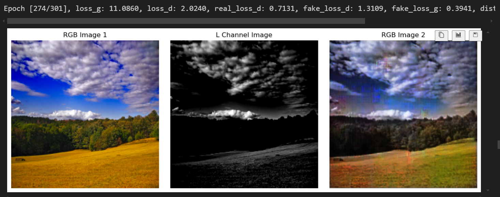
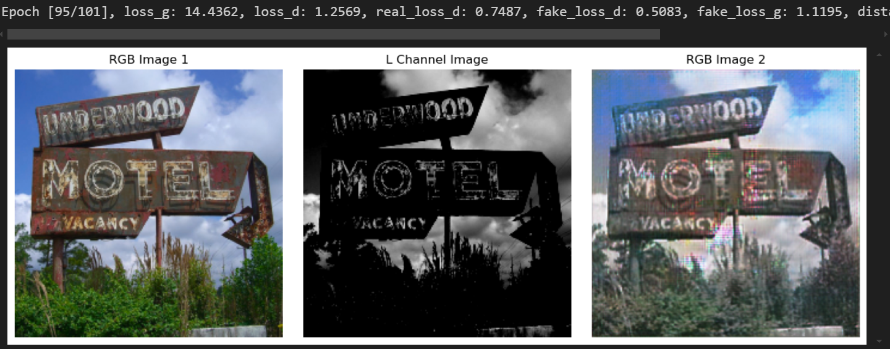
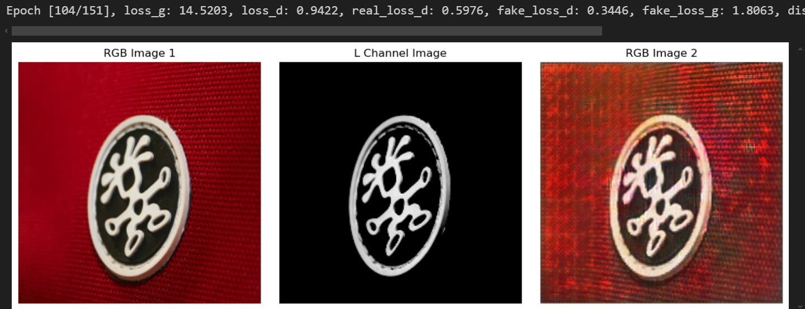
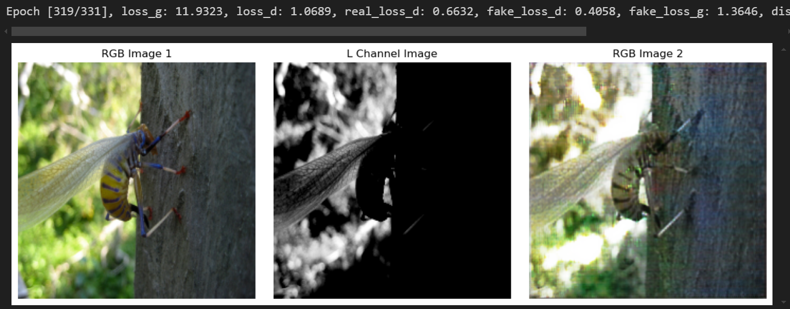

# IMAGE COLORIZER
This is an image colorizer which convert black and white image to rgb image.
I used the similar architecture as this paper [Image Colorization using Generative Adversarial Networks](https://arxiv.org/abs/1803.05400)
## Results from my colorizer

